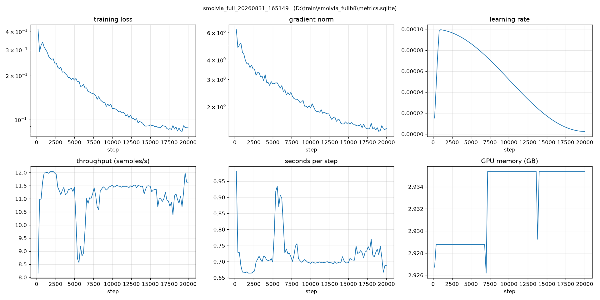

***Pick and Place***

A simple task of picking up objects on the table and placing it on a wooden plate.

Training turned out to be harder than it first appeared.

While the loss decreased and it appeared to have converged, it converged to a local minima.

The video below shows that the arm can position its effector toward the object but it fails the properly control the gripper to securely hold the object.

<video src="https://raw.githubusercontent.com/asd417/arm_ws/main/pick_and_place/try1/20260901%20093354_encoded.mp4" controls muted width="640"></video>

This may be due to the camera's position which, sometimes, the arm can block the view of the object.

Another potential issue is that the object has the same white color as the arm and the controller may not effectively pick up the object's position from the video feed.

Lastly, the camera input gets cropped to 512x512, further signalling the need to reposition the camera closer to the workspace.
